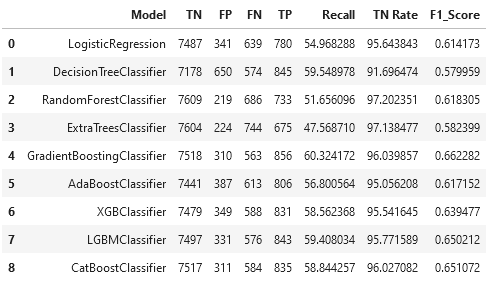
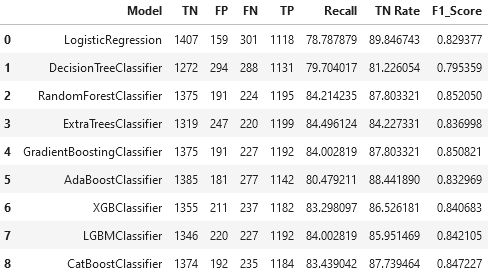
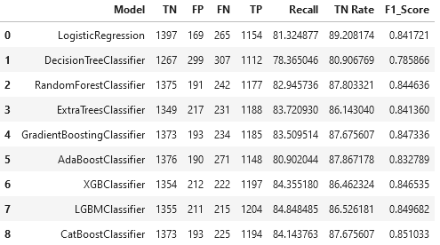
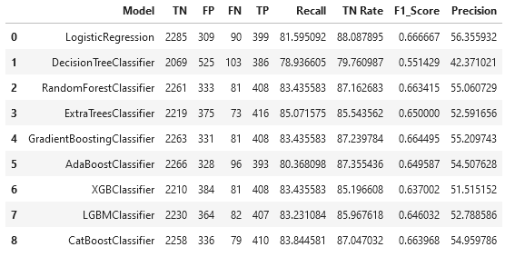
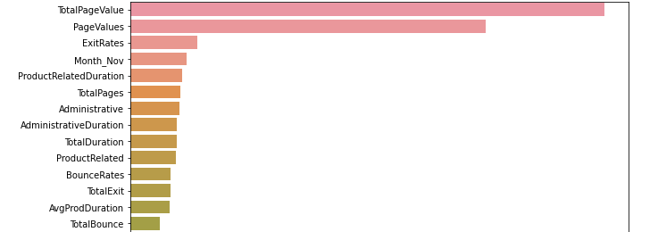
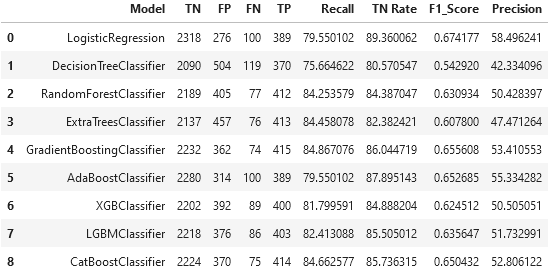

# Shopping Intention

Millions of people scour e-commerce websites daily. A small fraction of them intend to make a purchase, while others are only window shopping. It is critical for businesses convert these visitors into customers.

This project focuses on converting visitors with purchasing intent into customers. Among the several strategies to convert them are: showing personalized content to them; offering discounts and offers; and sending reminders about products they have viewed.

# Table of Contents
- <a href='#aim'>Aim</a>
- <a href='#data-description'>Data Description</a>
- <a href='#data-preprocessing'>Data Preprocessing</a>
- <a href='#model-building'>Model Building and Evaluation</a>
- <a href='#feature-engineering'>Feature Engineering</a>
- <a href='#test-evaluation'>Test Evaluation</a>
- <a href='#feature-importances'>Feature Importances</a>
- <a href='#feature-selection'>Feature Selection</a>
- <a href='#conclusion'>Conclusion</a>

# Aim

This project aims to investigate the factors that influence website visitors to complete a transaction on an e-commerce website

# Data Description

The data was sourced from <a href='https://archive.ics.uci.edu/ml/datasets/Online+Shoppers+Purchasing+Intention+Dataset#'>UCI Machine Learning Repository</a>. 

It contains 12330 rows and 18 columns with no missing values. Each row represents a session statistic for a unique visitor.

84.5 percent (10,422) of the 12,330 sessions in the dataset were negative class samples that did not end with shopping, while the rest (1908) were positive class samples that ended with shopping.

# Data Preprocessing

The preprocessing steps solely involved scaling numerical features and encoding categorical variables.

# Model Building and Evaluation

After training the models on the imbalanced classes, the models perform well in predicting the negative classes but perform poorly on the positive classes:

The majority class was undersampled and the models were retrained. The overall performance of the models improved but this technique trades off some performance on the negative classes:

# Feature Engineering

New Features were engineered and some categorical features with many unique values ('OperatingSystems','Browser','Region','TrafficType') were target encoded. 
This resulted in comparable performance to using unengineered features, but with less complexity.

# Test Evaluation

The performance on the unseen test set is similar to the validation results on the imbalanced classes but with better recall. However, this trades off some precision

# Feature Importances

The importances of the ExtraTreesClassifier were plotted:

# Feature Selection

The models produced the following test results when trained on the top 5 features

# Conclusion

Page properties, dwell time and the number of accessed pages can indicate if a visitor would finalize a transaction
